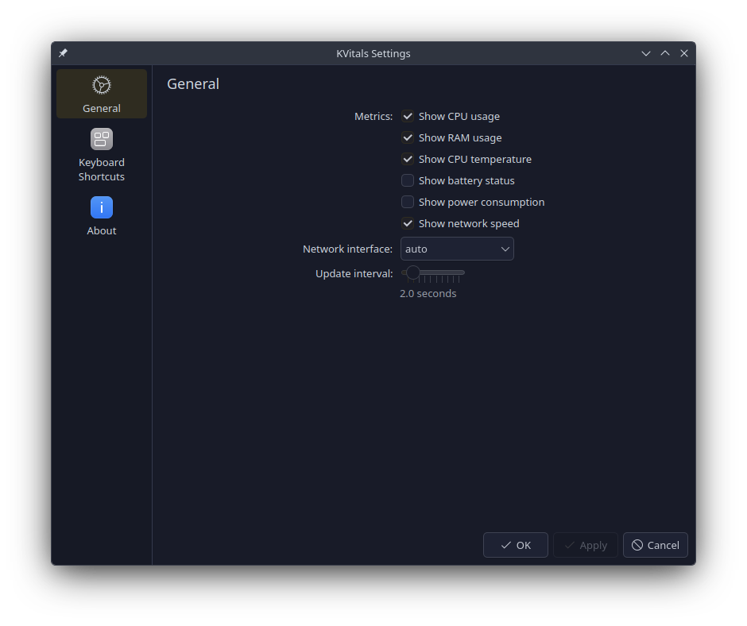

# KVitals

A lightweight KDE Plasma 6 panel widget that displays live system vitals directly in your top bar.

```
CPU: 26%  |  RAM: 8.8/39.0G  |  TEMP: 96°C  |  🔋BAT: 78%  |  PWR: +20W  |  NET: ↓82.2K ↑58.9K
```

## Screenshots




## Features

- **Live monitoring** — CPU usage, RAM, CPU temperature, battery status, network speed
- **Configurable** — Toggle each metric on/off via right-click → Configure
- **Adjustable refresh rate** — 1s to 10s update interval
- **Minimal footprint** — Simple bash script + QML, no heavy dependencies
- **Click to expand** — Detailed popup view with all stats

## Requirements

- KDE Plasma 6.0+
- Bash
- Git
- Standard Linux utilities (`free`, `awk`, `bc`)

## Installation

### KDE Store (Recommended)

Install directly from the KDE Store:

👉 **[Get KVitals on the KDE Store](https://www.pling.com/p/2347917/)**

Or from within KDE Plasma:
1. Right-click on the panel → **Add Widgets...**
2. Click **Get New Widgets...** → **Download New Plasma Widgets...**
3. Search for **"KVitals"**
4. Click **Install**

---

### Quick Install (curl)

```bash
curl -fsSL https://raw.githubusercontent.com/yassine20011/kvitals/master/install-remote.sh | bash
```

### Quick Install (wget)

```bash
wget -qO- https://raw.githubusercontent.com/yassine20011/kvitals/master/install-remote.sh | bash
```

### Manual Install

```bash
git clone https://github.com/yassine20011/kvitals.git
cd kvitals
bash install.sh
```

Then restart Plasma and add the widget:

```bash
plasmashell --replace &
```

1. Right-click on the panel → **Add Widgets...**
2. Search for **KVitals**
3. Drag it onto your panel

## Configuration

Right-click the widget → **Configure KVitals...** to:

- Toggle metrics: CPU, RAM, Temperature, Battery, Network
- Adjust the refresh interval (1–10 seconds)

## Uninstall

```bash
rm -rf ~/.local/share/plasma/plasmoids/org.kde.plasma.kvitals
```

Then restart Plasma: `plasmashell --replace &`

## Project Structure

```
kvitals/
├── metadata.json                  # Plasmoid metadata
├── install.sh                     # Local install script
├── install-remote.sh              # Remote install (curl/wget)
└── contents/
    ├── config/
    │   ├── config.qml             # Config page manifest
    │   └── main.xml               # Config schema (defaults)
    ├── scripts/
    │   └── sys-stats.sh           # System stats collector (bash)
    └── ui/
        ├── main.qml               # Widget UI
        └── configGeneral.qml      # Settings page UI
```

## License

GPL-3.0
