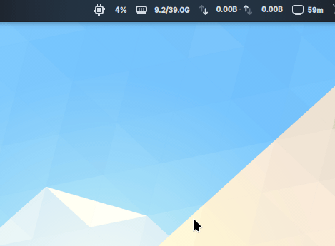
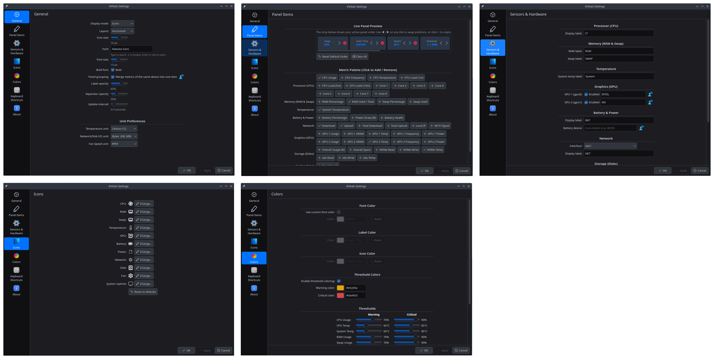

<div align="center">

# KVitals

**Live system stats in your KDE Plasma 6 panel bar: CPU, RAM, GPU, temp, battery, network, and disk.**

[](LICENSE)
[](https://www.opendesktop.org/p/2347917/)
[](https://github.com/yassine20011/kvitals/releases/latest)
[](https://github.com/yassine20011/kvitals/stargazers)

</div>

<div align="center">
  
</div>

---

Most KDE system monitors rely on shell scripts or heavy background programs. They run terminal commands or constantly write to temporary files, which wastes CPU and disk resources just to update a few numbers on your screen.

KVitals reads directly from KDE's built-in sensors instead. Because it doesn't run background scripts, it adds zero overhead to your system. It also only checks the metrics you actually use. If you hide your graphics card in the settings, the widget completely stops asking it for data.

```
CPU: 26% · 3.2GHz  |  RAM: 8.8/39.0G  |  TEMP: 58°C  |  🔋BAT: 78% · 20W  |  NET: ↓82.2K ↑58.9K  |  DSK: ↓1.2MB ↑76KB · 42°C
```

## Features

Here is what you can track and customize:

- **CPU**: Usage percentage, frequency, temperature, load averages (1m/5m/15m), and per-core CPU usage.
- **RAM & Swap**: Used/total memory and swap (percentage and absolute), with optional DDR5 temperature via the `spd5118` driver.
- **System temperature**: Auto-detects the chipset/motherboard sensor from lmsensors. Falls back to CPU average if no ISA-bus sensor is found.
- **GPU**: Usage, VRAM, temperature, core frequency, and power draw. Supports multiple GPUs independently with custom labels (iGPU, dGPU, etc.).
- **Fan speed**: Per-fan RPM and percentage with stable numbering.
- **Battery and power**: Automatically detects battery interfaces, charge percentage, health, and power draw in watts.
- **Network**: Download and upload speeds, session data totals (download/upload), Wi-Fi signal strength, local IP address display, and interface auto-detection.
- **Disk I/O, space, and temperature**: Per-drive read/write rates, overall used space, and per-disk temperature monitoring (displayed when the corresponding sensor is available through KSystemStats) with hotplug detection.
- **System uptime**: Live uptime pulled from `os/system/uptime`.
- **Interactive popup**: Categorized accordion view with live metric readings, click-to-pin toggles, and system shortcuts.
- **Visibility controls**: Choose where each metric appears — panel and popup, panel only, popup only, or disabled entirely.
- **Popup pin mode**: Keep the expanded popup open while working in other windows.
- **Display modes**: Text, icons, or icons and text, in horizontal or vertical panel layouts, with customizable desktop background styles (default, translucent, shadow, or fully transparent).
- **Color customization**: Font, label, and icon colors with per-metric threshold sliders for warning and critical states.
- **Custom ordering**: Drag and drop metrics to rearrange them.
- **Appearance**: Search system fonts and pick icons from your installed theme or bundled fallback icons.
- **Configuration profiles**: Save and switch between multiple named configurations (such as Gaming, Work, Minimal, or Battery) with independent panel layouts, metrics, and colors.
- **Quick profile switcher**: Switch active profiles instantly using a global keyboard shortcut (default: `Meta+Shift+V`) or from the settings page.
- **Resource efficiency**: Disabling a sensor stops all subscriptions — zero background overhead.

## Requirements

- KDE Plasma 6.0 or newer

## Get KVitals

### Install from the KDE Store (recommended)

You can search for KVitals directly in the Plasma widget explorer:

1. Right-click your panel and select **Add Widgets...**
2. Click **Get New Widgets...** and choose **Download New Plasma Widgets...**
3. Search for **KVitals** and select install.

Alternatively, you can visit the [KDE Store listing page](https://www.opendesktop.org/p/2347917/).

### Run the one-liner installer

Run one of these commands in your terminal to fetch and run the installer script:

```bash
# Using curl
curl -fsSL https://github.com/yassine20011/kvitals/releases/latest/download/install-remote.sh | bash

# Using wget
wget -qO- https://github.com/yassine20011/kvitals/releases/latest/download/install-remote.sh | bash
```

### Build manually

If you prefer to build from source:

```bash
git clone https://github.com/yassine20011/kvitals.git
cd kvitals
bash install.sh
```

After the installation completes, restart the Plasma shell and add the widget:

```bash
plasmashell --replace &
```

Right-click the panel, select **Add Widgets...**, search for **KVitals**, and drag it to your panel.

## Customization

Right-click the widget and select **Configure KVitals...** to open the settings dialog.

<div align="center">
  
</div>

| Tab | Available settings |
| :-- | :----------------- |
| **General** | Display modes (Text, Icons, Icons + Text), layouts (Horizontal or Vertical), icon dimensions, custom font selection, refresh intervals, and unit settings (°C/°F, bytes/bits). |
| **Panel Items** | Live interactive panel preview, drag-and-drop metric chip reordering, and categorized click-to-pin metric palette. |
| **Sensors & Hardware** | Custom device labels, per-GPU selection and discrete GPU power suspension, per-fan max RPM fallback, and network interface selection. |
| **Icons** | Custom symbolic icon selectors mapped to your active system icon theme with bundled SVG fallback support. |
| **Colors** | Font, label, and icon colors, per-metric warning and critical threshold sliders, and custom highlight colors. |
| **Profiles** | Named configuration profiles (create, duplicate, rename, delete, activate) and global shortcut configuration. |

### Configuration Profiles

KVitals supports multiple independent configuration profiles. You can configure separate metric sets, layouts, colors, and thresholds for different activities (such as full monitoring during gaming, a clean minimal setup for work, or low-overhead stats on battery).

#### Managing Profiles

Open widget settings and switch to the **Profiles** tab:

- **Create**: Enter a profile name and click **Add**.
- **Activate**: Select any profile in the list to switch to it immediately.
- **Duplicate**: Clone your current configuration to quickly create a customized variant.
- **Rename & Delete**: Rename existing profiles or delete profiles you no longer need (the Default profile is protected and cannot be deleted).

Every profile stores its settings independently. Switching profiles instantly updates your panel items, sensor polling, appearance, and thresholds.

#### Quick Switcher Shortcut

Press `Meta+Shift+V` from anywhere on your desktop to open the profile switcher popup:

- Use **Up** and **Down** arrow keys to browse profiles.
- Press **Enter** to activate the selected profile.
- Press **Escape** or click outside to dismiss without changes.
- You can also click directly on any profile using your mouse.
- The switcher automatically dismisses after 3 seconds of inactivity.

To change or disable the global shortcut, navigate to **Settings → Profiles** and record a new key sequence using the shortcut field.

You can find more details on [kvitals.dev](https://kvitals.dev) or in the [local configuration guide](docs/configuration.md).

## Uninstalling

You can remove KVitals through the Plasma Widget Explorer without touching the terminal: right-click your panel, select **Add Widgets...**, and click the uninstall icon next to KVitals.

### Manual / deep cleanup

If you built from source or want to ensure all local files are completely removed, run the following commands:

```bash
rm -rf ~/.local/share/plasma/plasmoids/org.kde.plasma.kvitals
rm -rf ~/.local/share/kpackage/generic/org.kde.plasma.kvitals
plasmashell --replace &
```

## Documentation

Read the local markdown files for deeper details on how to use and modify the widget:

- [Installation guide](docs/installation.md)
- [Configuration options](docs/configuration.md)
- [System architecture](docs/architecture.md)
- [Troubleshooting tips](docs/troubleshooting.md)
- [Contributing guidelines](docs/contributing.md)

Detailed documentation is also hosted at [kvitals.dev](https://kvitals.dev).

## Contributing

I welcome bug reports and pull requests. Please read [CONTRIBUTING.md](CONTRIBUTING.md) before submitting code.

- Open issues or request features on [GitHub Issues](https://github.com/yassine20011/kvitals/issues).
- Start a discussion or ask questions on [GitHub Discussions](https://github.com/yassine20011/kvitals/discussions).

## Contributors

<a href="https://github.com/yassine20011/kvitals/graphs/contributors">
  
</a>

## License and support

KVitals is licensed under the GPL-3.0 license. See the [LICENSE](LICENSE) file for the full text.

If the project helps you, consider giving it a star. If you like my project, you can support me:

[](https://github.com/sponsors/yassine20011)
